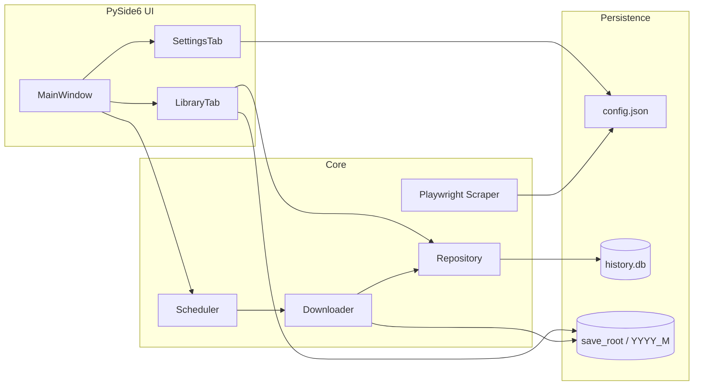

# JATIC-Library

<p align="center">
  <strong>JARTIC 断面交通量（typeB）の自動取得・保管・閲覧</strong><br>
  Windows 向けデスクトップアプリケーション
</p>

<p align="center">
  <a href="https://www.python.org/downloads/"></a>
  <a href="LICENSE"></a>
  
  <a href="docs/DEV_STATUS.md"></a>
</p>

<p align="center">
  <a href="docs/DESIGN.md">設計</a> ·
  <a href="docs/DEV_STATUS.md">開発状況</a> ·
  <a href="docs/DEV_SETUP.md">開発環境</a> ·
  <a href="docs/instructions/">実装指示書</a> ·
  <a href="https://github.com/matrix9neonebuchadnezzar2199-sketch/JATIC-Library">GitHub</a>
</p>

---

JARTIC（日本道路交通情報センター）が毎月公開する **断面交通量情報（typeB）** を、51 地域分の ZIP として自動取得し、ローカルに整理して閲覧するためのツールです。手作業でオープンデータページのボタンを押し続ける運用を、**起動時チェック・並列ダウンロード・保管庫ブラウザ** に置き換えます。

> **現在のリリース段階:** Pre-release — 機能は #01〜#21 まで実装済み。**配布用 exe のビルド検証・同梱は未完了**。[残作業一覧](docs/DEV_STATUS.md#5-残作業リリース配布まで) を参照。

---

## 目次

- [特長](#特長)
- [スクリーンショット](#スクリーンショット)
- [クイックスタート](#クイックスタート)
- [ドキュメント](#ドキュメント)
- [アーキテクチャ](#アーキテクチャ)
- [データの保存先](#データの保存先)
- [前提と制限](#前提と制限)
- [ライセンス](#ライセンス)

---

## 特長

### いま使える機能

| 領域 | 内容 |
|------|------|
| **取得** | 最大 51 地域の typeB ZIP を並列 DL（HTTP/2、リトライ、SHA256） |
| **スケジュール** | 起動時自動チェック（既定 24 時間に 1 回）／手動「今すぐ更新確認」 |
| **学習** | Playwright による `filename_key` 再スキャン → `targets.json` 更新 |
| **保管庫** | 年 → 月 → 地域 ZIP と統合 CSV、メタデータ詳細、容量表示 |
| **CLI** | `check` / `download` / `scrape` — ヘッドレス運用・自動化向け |
| **UI** | PySide6、保管庫・設定の 2 タブ、ライト／ダーク、トースト、トレイ、DL 進捗 |
| **保管庫拡張** | ソート、再 DL、削除、タグ、月次 ZIP/CSV エクスポート |
| **連携** | Git 自動 commit（push は手動）、スタートアップ登録 |

### 配布・残作業

**最終形態は Windows 向け exe（PyInstaller onedir）** です。ビルドスクリプトはありますが、成果物の検証・配布 zip・Playwright 同梱は未着手です。一覧は [開発状況 §5 残作業](docs/DEV_STATUS.md#5-残作業リリース配布まで)。

---

## スクリーンショット

> 配布ビルド（PyInstaller）完成後に画面キャプチャを追加予定です。

| 保管庫 | 設定 |
|--------|------|
| _準備中_ | _準備中_ |

---

## クイックスタート

### エンドユーザー（GUI）

**ベータ exe:** `dist/JATIC-Library/JATIC-Library.exe`（フォルダ一式必須）— zip は `dist/JATIC-Library-0.1.0-beta-win64.zip`。手順は [docs/BETA_TEST.md](docs/BETA_TEST.md)。

**開発環境から起動（現時点）:**

```powershell
git clone https://github.com/matrix9neonebuchadnezzar2199-sketch/JATIC-Library.git
cd JATIC-Library
uv venv --python 3.11
uv sync
uv run playwright install chromium
uv run python -m jatic_library
```

1. **設定**タブで保存先フォルダを指定し、「設定を保存」
2. 「今すぐ更新確認」または起動時自動チェックで DL
3. **保管庫**タブで取得済み ZIP を閲覧

### 開発者

```powershell
uv sync --group dev
uv run pytest -q
uv run ruff check src tests
uv run mypy
```

### CLI リファレンス

`%LOCALAPPDATA%\JATIC-Library\config.json` に `download.save_root` を設定したうえで:

| コマンド | 説明 |
|----------|------|
| `uv run python -m jatic_library` | GUI 起動 |
| `uv run python -m jatic_library check` | 更新確認（起動時チェック相当） |
| `uv run python -m jatic_library download -r tokyo` | 単一地域 DL |
| `uv run python -m jatic_library download --all` | 全 51 地域 |
| `uv run python -m jatic_library scrape` | サイト再スキャン |

---

## ドキュメント

| 文書 | 説明 |
|------|------|
| [docs/DESIGN.md](docs/DESIGN.md) | 全体設計・要件定義 |
| [docs/DEV_STATUS.md](docs/DEV_STATUS.md) | **実装進捗の正本**（指示書 #01〜#21、Phase、機能マトリクス） |
| [docs/DEV_SETUP.md](docs/DEV_SETUP.md) | 開発環境・検証手順 |
| [docs/ROADMAP.md](docs/ROADMAP.md) | Phase ロードマップ |
| [docs/instructions/](docs/instructions/) | Cursor 向け実装指示書（#01〜#21 完了） |
| [docs/USER_MANUAL.md](docs/USER_MANUAL.md) | ユーザーマニュアル（整備中） |

---

## アーキテクチャ



| レイヤ | 技術 |
|--------|------|
| GUI | PySide6 6.7 |
| HTTP | httpx（HTTP/2 → 1.1 フォールバック） |
| 動的取得 | Playwright（Chromium） |
| データ | SQLite、JSON manifest、polars（CSV プレビュー） |
| 配布 | PyInstaller `--onedir`（`build.bat`） |

---

## データの保存先

**ダウンロードデータ**（既定: アプリ直下の `data/`。設定で変更可）:

```text
[JATIC-Library]/data/
└── 2026_3/
    ├── 統合.csv
    ├── 東京都.zip
    ├── extracted/
    └── _manifest.json
```

**アプリデータ**（`%LOCALAPPDATA%\JATIC-Library\`）:

```text
config.json      # 設定
history.db       # 取得履歴・メタデータ
targets.json     # 学習済み filename_key
logs/            # アプリログ
```

公開フォルダ名 `2026_3` は「2026 年 3 月分データ」（公開は 2 か月遅れ）に対応します。詳細は [DESIGN.md](docs/DESIGN.md)。

---

## 前提と制限

- JARTIC が **現在公開している月分のみ** 取得可能（過去月の遡及 DL は不可）
- 公開は毎月 1 日想定だが遅延があり得る — 24 時間間隔の再チェックで吸収
- 地域 ZIP は数十 MB〜数 GB。Git 管理する場合は **Git LFS** を推奨
- 対象 OS: Windows 10 / 11（トースト・エクスプローラ連携）

---

## ライセンス

[MIT](LICENSE) — Copyright (c) matrix9neonebuchadnezzar2199-sketch
