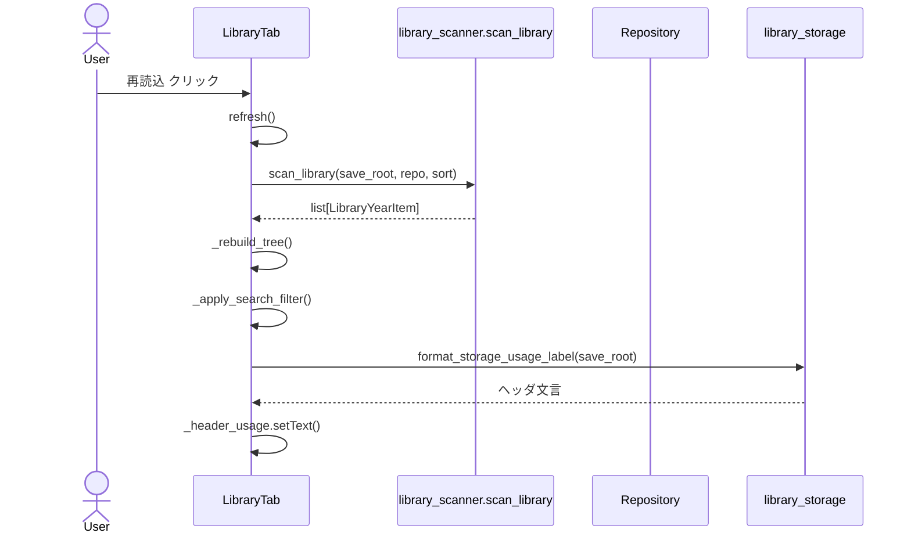
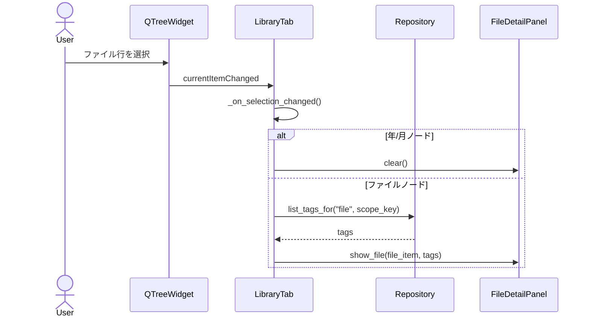
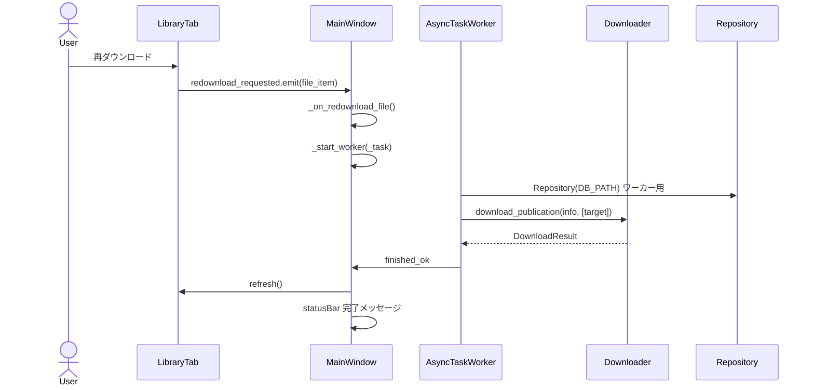
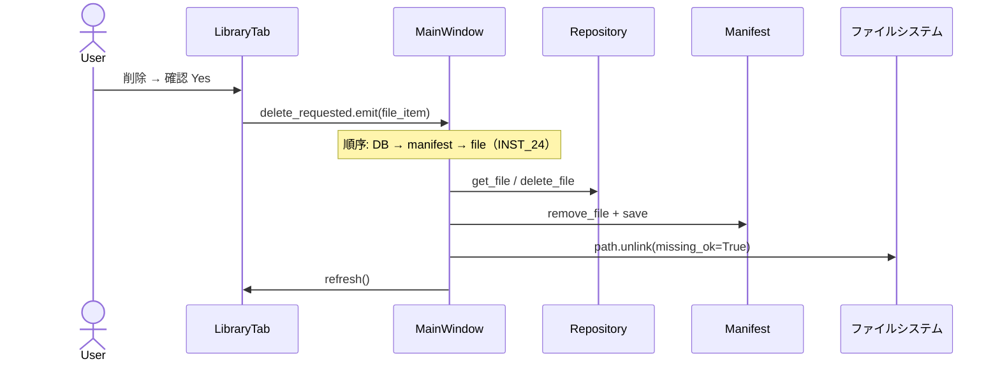
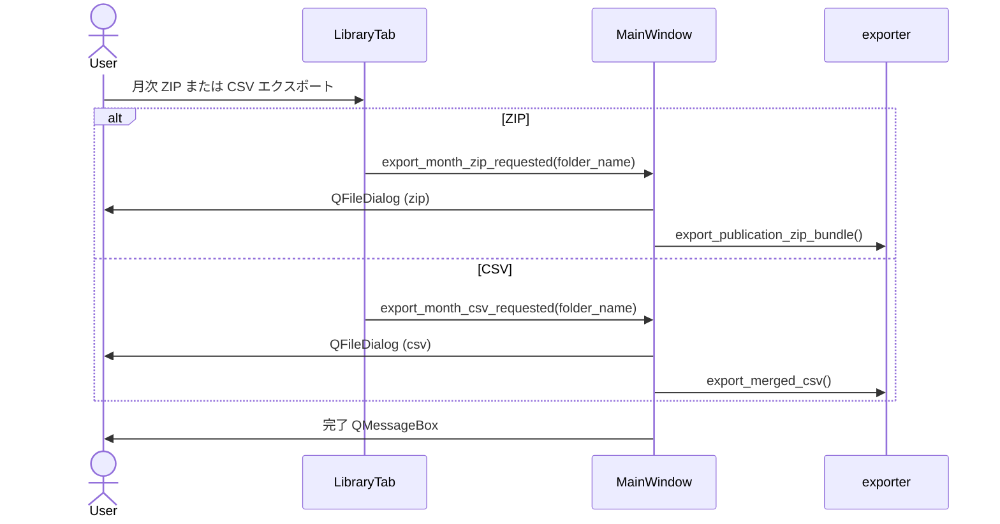
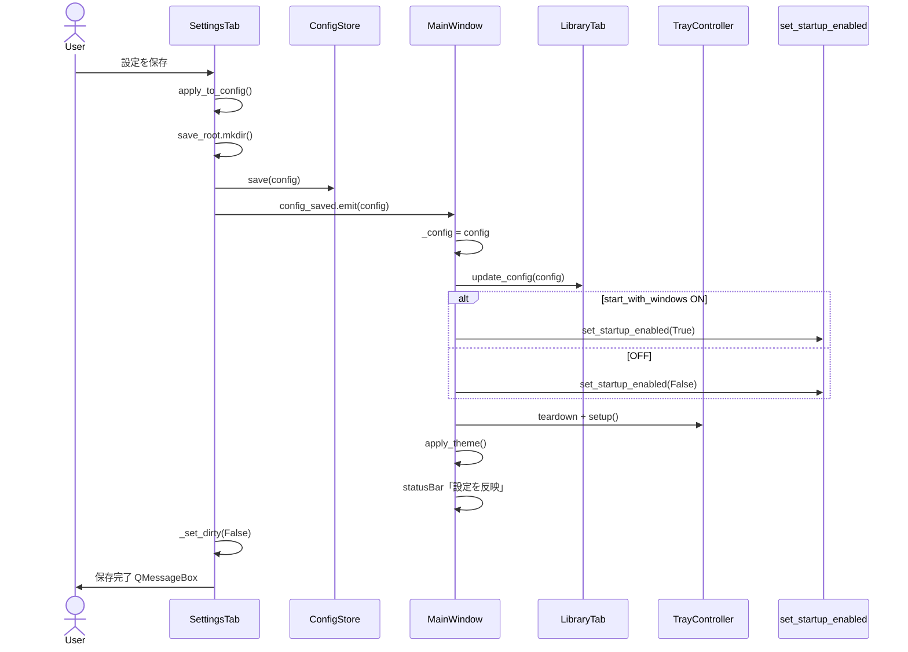
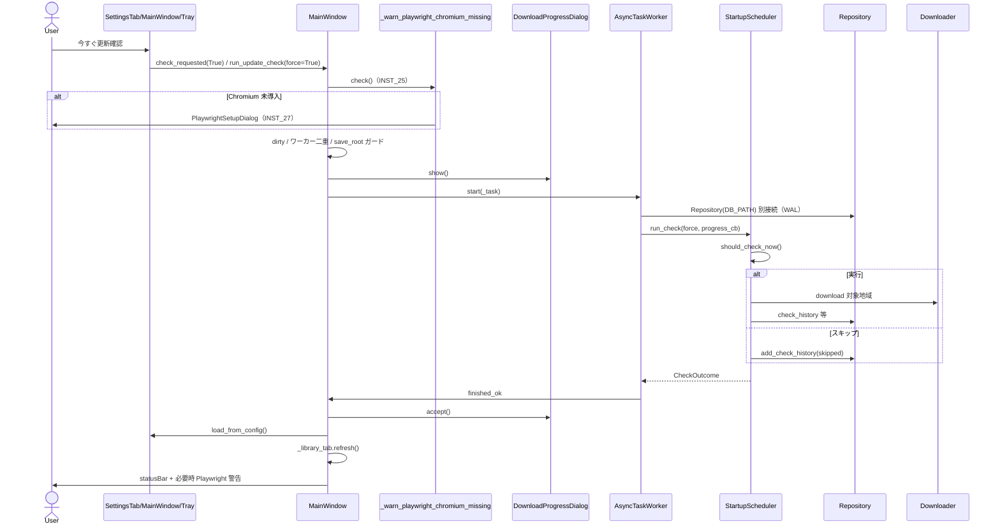
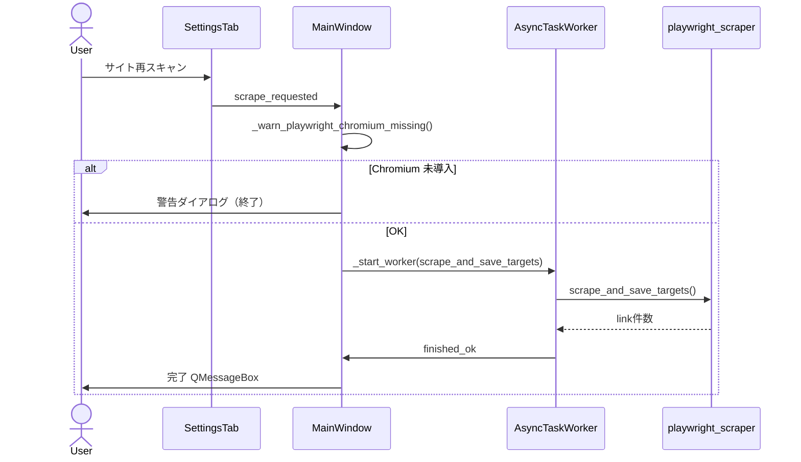
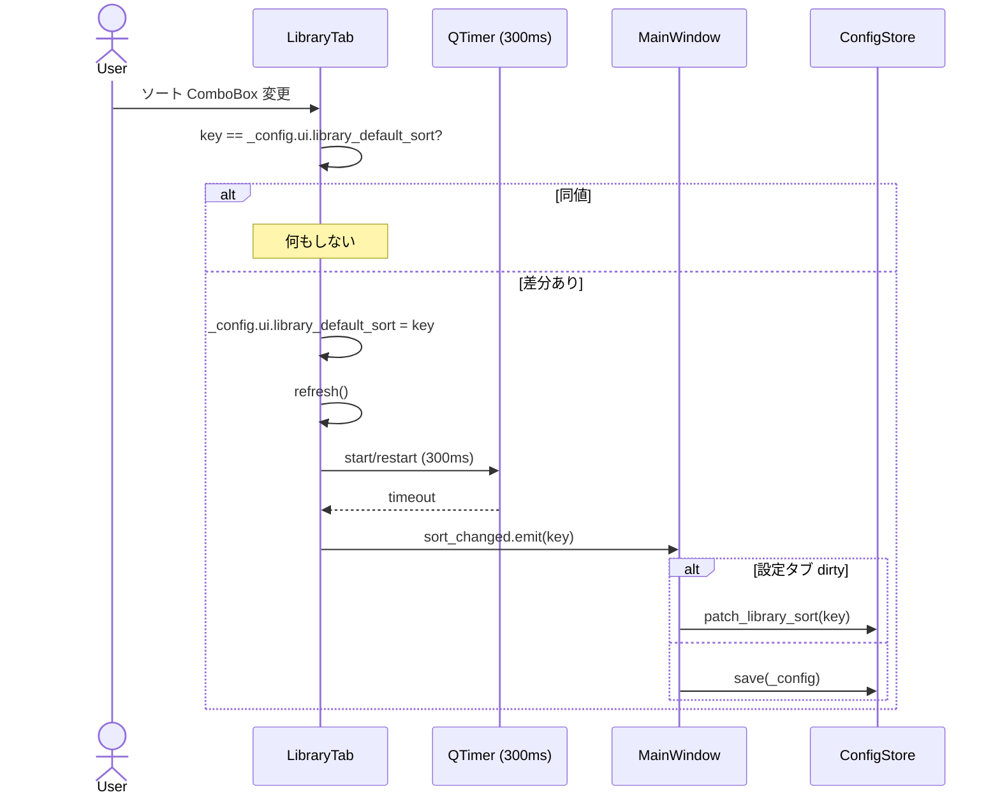

# UI フロー リファレンス

`MainWindow` のタブ構成、シグナル配線、主要操作のシーケンス図をまとめたドキュメントです。
構造設計は [DESIGN.md](./DESIGN.md)、操作手順は [USER_MANUAL.md](./USER_MANUAL.md) を参照してください。

**最終更新:** 2026-05-22
**対象バージョン:** Pre-release #01〜#21 完了時点

---

## 1. タブ構成

`MainWindow` は **2 タブ構成** です。メニュー・トレイはタブ外ですが、同じハンドラに接続される操作も含めて整理します。

### 1.1 保管庫タブ (`LibraryTab`)

| UI 操作 | 概要 | 主なコード |
|---|---|---|
| 再読込 | `save_root` を走査し、年→月→地域ツリーを再構築。ヘッダに容量表示を更新 | `refresh()` → `scan_library()` |
| ソート ComboBox | 並び順を `AppConfig.ui.library_default_sort` に反映し、ツリー再構築。JSON はデバウンス保存（設定 dirty 時は部分パッチ） | `_on_sort_changed()` → `sort_changed` → `_on_library_sort_changed()` → `patch_library_sort` or `save` |
| 検索欄 | 地域名でツリーノードの表示/非表示を切替（永続化なし） | `_apply_search_filter()` |
| ツリー選択（ファイル行） | 右ペインにメタデータ・タグ一覧を表示 | `_on_selection_changed()` → `FileDetailPanel.show_file()` + `Repository.list_tags_for()` |
| ツリー選択（年/月） | 詳細ペインをクリア | `_on_selection_changed()` → `FileDetailPanel.clear()` |
| 右クリック → エクスプローラーで開く | 親フォルダを `os.startfile` | `_open_context_menu()` 内ローカル |
| 右クリック → パスをコピー | クリップボードにファイルパス | 同上 |
| 右クリック → 再ダウンロード | 該当地域 ZIP を再取得（統合.csv は対象外） | `redownload_requested` → `MainWindow._on_redownload_file()` |
| 右クリック → 削除 | 確認後、ファイル・manifest・DB 行を削除 | `_confirm_delete()` → `delete_requested` → `_on_delete_file()` |
| 右クリック → タグを管理 | 既存タグ付与/解除または新規作成（DB のみ） | `_manage_tags()` → `Repository` |
| 右クリック（月ノード）→ ZIP / CSV エクスポート | 各メニューから直接保存ダイアログ | `export_month_zip_requested` / `export_month_csv_requested` → `_on_export_month_zip` / `_on_export_month_csv` |
| タブ表示時 | ストレージ使用量ラベルを更新 | `showEvent()` → `_update_storage_header()` |

右ペイン `FileDetailPanel` は **表示専用**（ボタンなし）です。

### 1.2 設定タブ (`SettingsTab`)

| UI 操作 | 概要 | 主なコード |
|---|---|---|
| 地域チェックボックス | 選択状態をメモリ上の `_config` に反映（保存まで未永続） | `RegionSelector` → `selection_changed` → `_update_region_summary()` |
| 全選択 / 全解除 / 地方別 | 地域選択 UI のみ | `region_selector.py` |
| 参照… | 保存先フォルダを `QLineEdit` にセット | `_browse_save_root()` |
| 設定を保存 | ウィジェット→`AppConfig`、フォルダ作成、`config.json` 保存、トレイ/テーマ反映 | `save_to_store()` → `config_saved` → `MainWindow._on_config_saved()` |
| 今すぐ更新確認 | 強制チェック＋必要なら DL（進捗ダイアログ） | `check_requested(True)` → `run_update_check(force=True)` |
| サイト再スキャン | Playwright で JARTIC を巡回し `targets.json` 更新 | `scrape_requested` → `run_scrape()` |

右列の各フィールド（テーマ、スケジュール、DL 並列数、通知、ログ、トレイ、Git）は **「設定を保存」を押すまで** `apply_to_config()` 経由でまとめて永続化されます（未保存状態の可視化は [INST_23](./instructions/INST_23_settings_dirty_indicator.md) を参照）。

### 1.3 タブ外（メニュー・トレイ・自動）

| 操作 | 接続先 |
|---|---|
| メニュー「今すぐ更新確認」 | `run_update_check(force=True)` |
| メニュー「サイト再スキャン」 | `run_scrape()` |
| 起動時自動チェック | `MainWindow.__init__` → `run_update_check(force=False)` |
| トレイ「今すぐ確認」 | `run_update_check(force=True)` |
| × 閉じる（トレイ有効時） | `closeEvent` → ウィンドウ非表示（終了しない） |

---

## 2. シーケンス図

### 2.1 保管庫 — 再読込



### 2.2 保管庫 — ファイル選択 → 詳細表示



### 2.3 保管庫 — 再ダウンロード（右クリック）



### 2.4 保管庫 — 削除（右クリック）



> **注:** 旧実装は file → manifest → DB の順でしたが、途中失敗時の不整合を避けるため
> [INST_24](./instructions/INST_24_delete_order_safety.md) で逆順（DB → manifest → file）に変更しました。
> 各ステップは冪等です。

### 2.5 保管庫 — 月次エクスポート（右クリック）



### 2.6 設定 — 設定を保存



### 2.7 設定 — 今すぐ更新確認（＋メニュー/トレイ/起動時）



### 2.8 設定 — サイト再スキャン



### 2.9 保管庫 — ソート変更（デバウンス付き保存）



> **補足:** デバウンスとガードの実装は [INST_22](./instructions/INST_22_library_sort_debounce.md) を参照。

---

## 3. コード参照（エントリポイント）

### 3.1 タブ登録とシグナル配線

```python
# src/jatic_library/ui/main_window.py
self._tabs = QTabWidget()
self._library_tab = LibraryTab(config, repo)
self._settings_tab = SettingsTab(config, store)
self._tabs.addTab(self._library_tab, "保管庫")
self._tabs.addTab(self._settings_tab, "設定")

self._settings_tab.config_saved.connect(self._on_config_saved)
self._settings_tab.check_requested.connect(self.run_update_check)
self._settings_tab.scrape_requested.connect(self.run_scrape)
self._library_tab.redownload_requested.connect(self._on_redownload_file)
self._library_tab.delete_requested.connect(self._on_delete_file)
self._library_tab.export_month_zip_requested.connect(self._on_export_month_zip)
self._library_tab.export_month_csv_requested.connect(self._on_export_month_csv)
self._library_tab.sort_changed.connect(self._on_library_sort_changed)
```

### 3.2 バックグラウンド処理の共通パターン

```python
def _start_worker(
    self,
    coro_factory: Callable[[], Coroutine[Any, Any, object]],
    ...
) -> None:
    worker = AsyncTaskWorker(coro_factory, self)
    worker.finished_ok.connect(_done)
    worker.failed.connect(_fail)
    worker.start()
```

ワーカー内で生成する `Repository` は **メインスレッドの接続と別インスタンス** です。SQLite を
複数スレッドから安全に扱うため WAL モードを前提とします（[INST_26](./instructions/INST_26_sqlite_wal_mode.md)）。

---

## 4. 未実装機能の扱い

`DEV_STATUS.md` の以下は `MainWindow` に未配線です。Phase P11 以降に切り出されています。

- #16 カレンダー（欠損可視化）
- #17 比較タブ
- #18 ZIP/CSV エクスポート用チャート（`TrafficChartWidget`）

指示書ファイル自体は `docs/instructions/` に残してありますが、現行ビルドの動作要件には含まれません。
月次 ZIP / 統合 CSV のエクスポート（右クリックメニュー）は #18 の一部として **実装済み** です。
